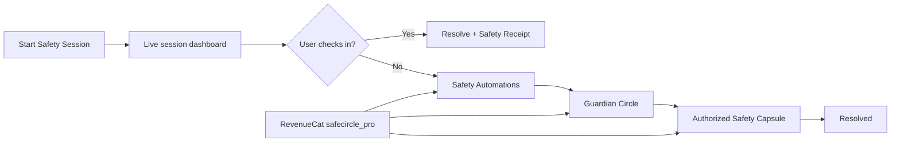
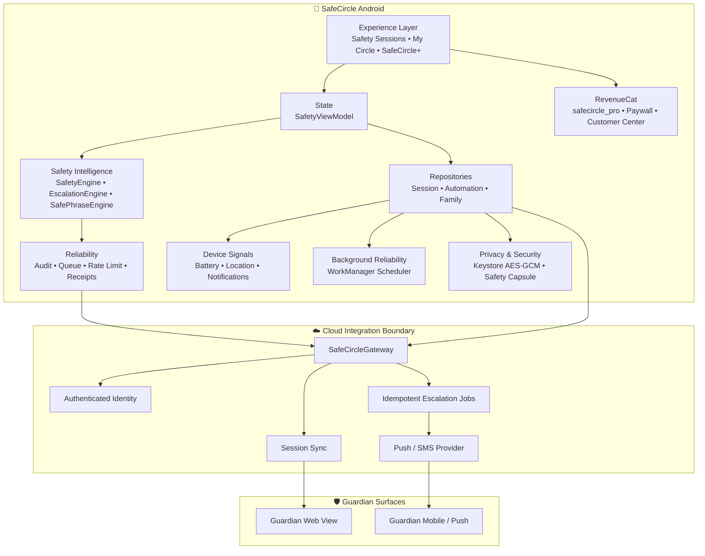
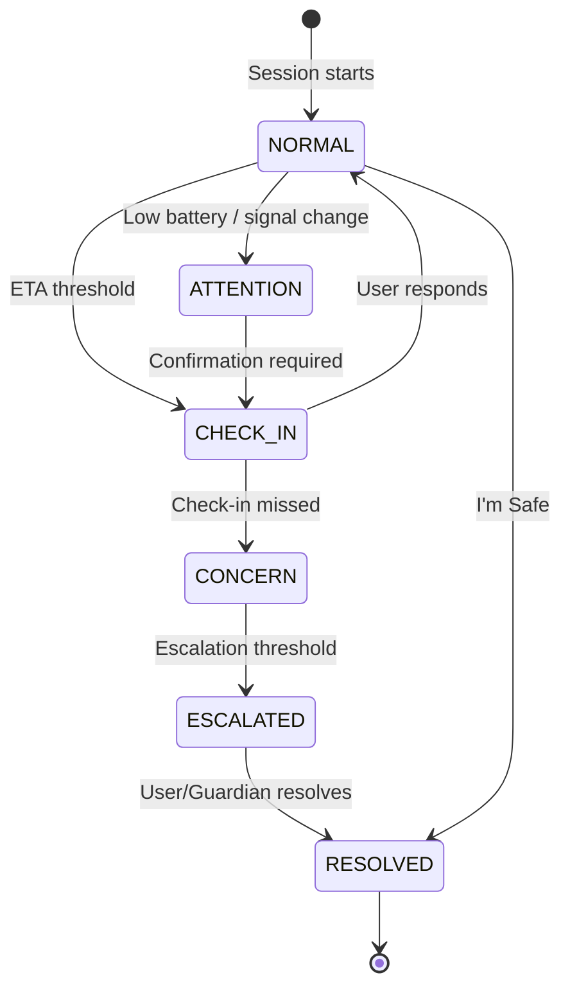
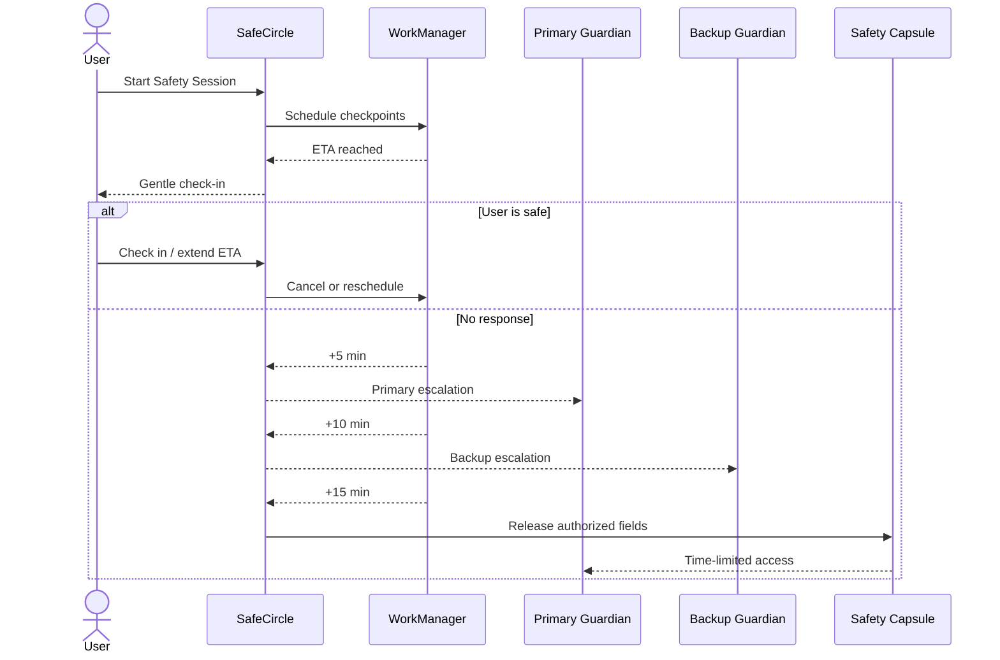

# 🛡️ SafeCircle

<div align="center">

### **Someone should notice.**

**A programmable personal-safety network that turns everyday journeys into protected Safety Sessions.**

Walk home. Take a rideshare. Meet someone new. Travel alone.  
SafeCircle helps you decide **who should notice, what they should know, and what should happen if you don't check in.**


</div>

---

## 🌎 The Problem

Personal safety tools often begin **after something has already gone wrong**.

A panic button is valuable, but many real-life situations develop gradually:

- a walk home takes longer than expected;
- a rideshare goes off schedule;
- someone misses a promised check-in;
- a phone battery becomes critically low;
- a person meeting someone new wants a discreet way to ask for help;
- a family member wants reassurance without demanding permanent location access.

Today, users often solve this manually by sending messages like:

> “I'm leaving now.”  
> “I'll text you when I get home.”  
> “If I don't message by 10:30, call me.”

That informal safety protocol is easy to forget, difficult to coordinate, and usually has no structured escalation.

**SafeCircle turns that social promise into a programmable safety workflow.**

---

# 💡 The Idea

SafeCircle is not designed as another panic-button app.

It introduces a new primitive:

## **The Safety Session**

Before entering a situation where they want someone to notice, the user starts a temporary Safety Session.

```text
START SESSION
      │
      ▼
Expected-safe time
      │
      ▼
Check-ins + session signals
      │
      ▼
Explainable Safety State
      │
      ├── Everything normal ────────────────┐
      │                                     │
      └── Condition changes                 │
             │                              │
             ▼                              │
       Request check-in                     │
             │                              │
       no response                          │
             ▼                              │
       Guardian escalation                  │
             │                              │
             ▼                              │
       Safety Capsule                       │
                                            │
User confirms safe ─────────────────────────┘
                    │
                    ▼
                 RESOLVED
```

The goal is simple:

> **Make safety decisions while you're safe — not while you're scared.**

---

# ✨ Core Experiences

## 🚶 Walk Home

Create a short Safety Session before walking alone.

SafeCircle records the expected-safe time and keeps the session visible until the user checks in or resolves it.

## 🚕 Rideshare

Create a temporary session around a taxi or rideshare journey.

The architecture is designed to support trip metadata, vehicle information, expected arrival, route signals, and Guardian escalation without depending on a specific rideshare provider.

## 🤝 Meet Someone

Useful when meeting someone unfamiliar.

A user can establish an expected end time and configure a discreet check-in/escalation plan before the meeting begins.

## 🫶 Stay With Me

Safety does not always involve travel.

Someone waiting alone in a parking lot, transit station, campus, or unfamiliar location can create a short temporary Guardian session and end it when they feel safe.

---

# 🧠 Explainable Safety Engine

SafeCircle deliberately avoids claiming that an algorithm can determine whether someone is “in danger.”

Instead, it evaluates **observable Safety Session conditions**.

### State machine

```text
 NORMAL
   │
   ▼
ATTENTION
   │
   ▼
CHECK_IN
   │
   ▼
 CONCERN
   │
   ▼
ESCALATED
   │
   ▼
RESOLVED
```

The prototype evaluates signals such as:

| Signal | Example interpretation |
|---|---|
| Expected-safe time | Is the session overdue? |
| Check-in status | Has a scheduled confirmation been missed? |
| Battery | Is the device approaching a low-battery condition? |
| Route signal | Has an optional route-deviation signal changed? |
| Session state | Has the user already resolved the session? |

The engine returns both a state and the reasons behind it.

Example:

```text
Safety Readiness
62 / 100

CONCERN

• 1 check-in missed
• Route deviation signal detected
• Battery below 20%
• ETA still within current window
```

That makes the experience **explainable rather than mysterious**.

---

# ⚡ Safety Readiness

SafeCircle surfaces a simple readiness score to help the user understand whether their Safety Session is well prepared.

A strong session might show:

```text
92 / 100

✓ Expected-safe time configured
✓ Check-ins current
✓ Battery sufficient
✓ Route signal normal
```

The score is not a prediction of crime or danger.

It is an interface for explaining the completeness and current conditions of the user's Safety Session.

---

# 👥 Guardian Circle

A Safety Session becomes useful when another trusted person can participate.

SafeCircle models three Guardian roles:

```text
Primary Guardian
       │
       ▼
Backup Guardian
       │
       ▼
Family / Trusted Circle
```

The product vision is privacy-first: a Guardian should not automatically receive permanent access to someone's precise location.

Instead, the user chooses what each Guardian can access and under which conditions.

### Example Guardian view

```text
Harsha's Walk Home

Started        9:43 PM
Expected safe  10:05 PM
Status         On schedule ✓
Last check-in  1 min ago

[ REQUEST CHECK-IN ]   [ CALL ]
```

---

# ⚙️ Programmable Safety Automations

This is one of SafeCircle's central product ideas:

## **IF something happens → THEN execute my safety plan.**

Examples:

```text
IF
    expected-safe time passes
AND
    I miss my check-in

THEN
    ask me if I'm safe
    ↓
    notify Primary Guardian
    ↓
    notify Backup Guardian
    ↓
    release pre-authorized Safety Capsule
```

The codebase models triggers including:

- `MISSED_CHECK_IN`
- `ETA_OVERDUE`
- `ROUTE_DEVIATION`
- `LOW_BATTERY`
- `DURESS_PHRASE`

and actions including:

- `PROMPT_USER`
- `NOTIFY_PRIMARY_GUARDIAN`
- `NOTIFY_BACKUP_GUARDIAN`
- `SHARE_SAFETY_CAPSULE`

Think of it as:

> **IFTTT for personal safety — with consent and privacy built in.**

---

# 🚨 Progressive Escalation

SafeCircle avoids jumping immediately from “slightly late” to “emergency.”

Instead, users can establish an escalation ladder before the session.

### Prototype policy

| Time | Action |
|---:|---|
| **0 min** | Gentle check-in |
| **+5 min** | Notify Primary Guardian |
| **+10 min** | Notify Backup Guardian |
| **+15 min** | Release pre-authorized Safety Capsule |

A production implementation would make these thresholds configurable and execute them through a reliable backend scheduler.

---

# 🤫 SafePhrase & Silent Safety

Not every uncomfortable situation allows someone to visibly press an SOS button.

SafeCircle's architecture includes **SafePhrase**, allowing the user to preconfigure discreet phrases.

### Yellow Phrase

> “Something feels wrong. Check on me.”

Signal:

```text
CHECK_ON_ME
```

### Red Phrase

Triggers the user's preconfigured silent escalation workflow.

Signal:

```text
SILENT_ESCALATION
```

The prototype contains the domain engine for evaluating these phrases. Production implementation requires careful UX, abuse prevention, authentication, and reliable remote escalation infrastructure.

---

# 🔐 Safety Capsule

A Safety Capsule is a temporary package of information that the user authorizes **before** escalation.

It is designed to support fields such as:

- Safety Session ID
- destination
- last-known location label
- battery level
- Guardian instructions
- timestamps
- user-approved precise-location access
- automatic expiration

Example:

```text
Safety Capsule
SC-8292

Session       Walk Home
Destination   Home
Battery       16%
Instructions  "Call me first. If I do not answer,
               contact my backup Guardian."

Precise location:
LOCKED until configured escalation threshold

Expires automatically
```

The important principle is:

> **Information should be shared because the user authorized it — not simply because the app collected it.**

A production Safety Capsule should use encryption at rest and in transit, strict authorization, audit logging, and automatic retention/deletion policies.

---

# 🔒 Privacy by Design

Personal-safety software can itself create privacy risks.

SafeCircle therefore starts with several design principles:

### 1. Temporary rather than permanent

Safety Sessions have a beginning and an end.

### 2. Minimum necessary sharing

Guardians should see the minimum information needed for the current state.

### 3. Progressive disclosure

Precise information can remain private until a user-defined escalation threshold is reached.

### 4. Explicit consent

The user decides what belongs in a Safety Capsule.

### 5. Explainability

SafeCircle reports conditions such as “check-in missed” rather than making unsupported claims such as “danger detected.”

### 6. Safety should not depend on payment

Core safety/check-in functionality remains available without SafeCircle+.

---

# 💎 SafeCircle+ — RevenueCat Integration

SafeCircle uses **RevenueCat** as part of the product architecture rather than adding subscriptions as an afterthought.

### Current integration

| Component | Configuration |
|---|---|
| RevenueCat Android SDK | `10.20.0` |
| RevenueCat UI | `10.20.0` |
| Entitlement | `safecircle_pro` |
| Offering | `default` |
| Packages | `monthly`, `yearly` |
| Hosted Paywall | ✅ |
| CustomerInfo refresh | ✅ |
| Restore Purchases | ✅ |
| Customer Center | ✅ |

### Entitlement model

```text
Monthly ─────┐
             │
             ├────► safecircle_pro
             │
Yearly ──────┘
```

The application gates premium functionality through the entitlement rather than checking individual product IDs.

This means subscription products can evolve without rewriting feature-access logic.

---

# 🆓 Free vs SafeCircle+

Essential safety functionality should never disappear because a subscription expires.

| Capability | Free | SafeCircle+ |
|---|:---:|:---:|
| Basic Safety Sessions | ✅ | ✅ |
| Basic check-ins | ✅ | ✅ |
| One Guardian | ✅ | ✅ |
| Walk Home | ✅ | ✅ |
| Stay With Me | ✅ | ✅ |
| Unlimited Safety Sessions | — | ✅ |
| Multiple Guardians | — | ✅ |
| Advanced Safety Automations | — | ✅ |
| SafePhrase workflows | — | ✅ |
| Advanced escalation rules | — | ✅ |
| Safety Capsule controls | — | ✅ |
| Guardian Live View | — | ✅ |
| Family Circle | — | ✅ |

The final packaging may evolve during product validation.

---

# 📱 Product Surfaces

SafeCircle now exposes the roadmap as real product screens rather than leaving features only in architecture notes.

| Screen | What it demonstrates | Phase |
|---|---|---|
| **Today** | Start Safety Sessions, live readiness score, countdown, real battery signal, session-scoped location state, check-in, I'm Safe, ETA extension, escalation preview | 1 + 2 |
| **Automate** | IF → THEN safety rules, custom automation creation, recurring commute reminders, configurable SafePhrase, local SafePhrase test | 2 + 4 |
| **Circle** | Guardian Live summary, Guardian invite sharing, Primary/Backup Guardian model, Family Circle creation and member management | 2 + 4 |
| **Vault** | Android Keystore/AES-GCM capsule storage, privacy mode, encrypted capsule creation, expiry purge, audit trail, session history, Safety Receipt sharing | 3 |
| **Pro** | RevenueCat `safecircle_pro` status, hosted Paywall, Customer Center, restore purchases, stable account identity, editable Emergency Profile | 1 + 4 |

### Core product loop



### What is intentionally free

Basic Safety Sessions, check-ins, one Guardian, "I'm Safe", and essential session visibility are not designed to disappear because a subscription expires.

### What SafeCircle+ unlocks

Advanced automations, recurring routines, Family Circles, configurable SafePhrase workflows, and advanced Vault/privacy controls use the RevenueCat entitlement boundary.

---

# 🏗️ Architecture

SafeCircle now uses a layered architecture that separates **safety decisions**, **device signals**, **privacy**, **reliability**, **Guardian delivery**, and **monetization**.



### Safety Session lifecycle



### Privacy-first escalation



See **[docs/ARCHITECTURE.md](docs/ARCHITECTURE.md)** for the full component, state-machine, offline-reliability, privacy, and RevenueCat diagrams.

---

# 🧰 Technology Stack

| Layer | Technology |
|---|---|
| Mobile | Native Android |
| Language | Kotlin |
| UI | Android Views + Material Components |
| Architecture | ViewModel + Repository + Domain engines |
| Navigation | AndroidX Navigation |
| State | LiveData |
| Local persistence | SharedPreferences prototype |
| Monetization | RevenueCat |
| Subscription UI | RevenueCat Paywalls |
| Subscription management | RevenueCat Customer Center |
| Build | Gradle Kotlin DSL |

---

# 📁 Project Structure

```text
safecircle/
│
├── app/
│   └── src/main/
│       ├── java/com/harshapriya/safecircle/
│       │   ├── MainApplication.kt
│       │   ├── MainActivity.kt
│       │   │
│       │   ├── billing/
│       │   │   └── SubscriptionManager.kt
│       │   │
│       │   ├── data/
│       │   │   ├── Constants.kt
│       │   │   └── SafetyRepository.kt
│       │   │
│       │   ├── domain/
│       │   │   ├── SafetyEngine.kt
│       │   │   ├── EscalationEngine.kt
│       │   │   └── SafePhraseEngine.kt
│       │   │
│       │   ├── model/
│       │   │   ├── SafetyModels.kt
│       │   │   ├── SafetyAutomation.kt
│       │   │   └── SafetyCapsule.kt
│       │   │
│       │   └── ui/
│       │       ├── home/
│       │       ├── circle/
│       │       ├── profile/
│       │       └── shared/
│       │
│       └── res/
│           ├── layout/
│           ├── navigation/
│           ├── menu/
│           ├── drawable/
│           └── values/
│
├── docs/
│   └── ARCHITECTURE.md
│
├── gradle/
│   └── libs.versions.toml
│
├── local.properties.example
└── README.md
```

---

# 🚀 Getting Started

## Prerequisites

- Android Studio
- JDK compatible with the configured Android Gradle Plugin
- Android SDK
- RevenueCat project
- Google Play / RevenueCat test configuration for purchase testing

## 1. Clone

```bash
git clone https://github.com/harshapriyag123/safecircle.git
cd safecircle
```

## 2. Configure RevenueCat

Copy the example configuration:

```properties
# local.properties
sdk.dir=/your/android/sdk/path
REVENUECAT_API_KEY=test_your_public_sdk_key_here
```

**Do not commit secret RevenueCat backend API keys.**

The Android SDK uses a public/client SDK key.

## 3. RevenueCat dashboard

Configure:

```text
Entitlement
└── safecircle_pro

Offering
└── default
    ├── monthly
    └── yearly
```

Both packages should unlock:

```text
safecircle_pro
```

Then create and publish a RevenueCat Paywall for the offering.

## 4. Build

Open the project in Android Studio, sync Gradle, then build/run on an emulator or Android device.

---

# 🧪 Hackathon Demo Flow

A short demo can tell the entire story.

### Scene 1 — “I'm walking home.”

Open SafeCircle.

Show:

```text
Safety Readiness
92 / 100
NORMAL
```

Tap:

> **Start Safety Session → Walk Home**

Explain:

> “Instead of remembering to text someone when I arrive, I create a temporary safety contract with my Circle.”

### Scene 2 — Explainability

Show expected-safe time and active session.

Tap:

> **Demo: simulate concern state**

The state changes based on observable signals.

Explain:

> “SafeCircle isn't claiming AI knows I'm in danger. It tells my Circle exactly what changed.”

### Scene 3 — Guardian Circle

Open **My Circle**.

Explain Primary Guardian → Backup Guardian → Family Circle.

Then explain progressive disclosure:

> “My exact location doesn't need to be visible 24/7. I choose when it becomes available.”

### Scene 4 — Safety Automation

Show the escalation ladder:

```text
missed check-in
      ↓
ask me
      ↓
primary guardian
      ↓
backup guardian
      ↓
Safety Capsule
```

### Scene 5 — RevenueCat

Open **SafeCircle+**.

Launch the real RevenueCat Paywall.

Show entitlement-based premium access and subscription management.

### Closing line

> **“SafeCircle makes the promise ‘text me when you get home’ programmable.”**

---

# 🎯 Why SafeCircle Is Different

### Not just SOS

SafeCircle begins before an emergency.

### Not surveillance

Guardians do not need permanent location access.

### Not a black-box danger score

The Safety Engine explains the conditions behind every state.

### Not a one-person tool

Safety is modeled as a trusted network.

### Not monetization bolted onto a demo

RevenueCat is integrated into the entitlement architecture, Paywall, restore flow, and Customer Center.

### Not “AI says you're unsafe”

SafeCircle keeps the user in control and treats automation as orchestration, not omniscient prediction.

---

# 🛣️ Product Roadmap

## Phase 1 — Hackathon Prototype

- [x] Native Android foundation
- [x] Safety Session modes
- [x] Safety Readiness
- [x] Explainable Safety Engine
- [x] Guardian Circle model
- [x] Progressive escalation model
- [x] SafePhrase domain engine
- [x] Safety Capsule model
- [x] RevenueCat entitlement integration
- [x] RevenueCat Paywall
- [x] Restore purchases
- [x] Customer Center

## Phase 2 — Connected Safety

- [x] Stable local account identity + cloud identity contract
- [x] Expiring Guardian invite/share flow
- [x] Local safety notifications
- [x] Guardian web prototype
- [x] Background escalation scheduler with WorkManager
- [x] Real Android battery integration
- [x] User-consented Android location adapter
- [x] Editable ETA API + job rescheduling
- [x] Offline event queue
- [ ] Connect production push/SMS provider
- [ ] Connect authenticated multi-device backend sync

## Phase 3 — Privacy & Reliability

- [x] Android Keystore + AES-GCM Safety Capsule encryption
- [x] Capsule expiry + purge support
- [x] Local audit trail
- [x] Delivery receipt model
- [x] Idempotent escalation-stage keys
- [x] Rate limiting
- [x] Offline retry queue
- [x] Threat model
- [ ] Production accessibility audit
- [ ] External security review

## Phase 4 — SafeCircle Family

- [x] RevenueCat entitlement architecture ready for Family tier
- [x] Local Family Circle repository
- [x] Recurring commute scheduler
- [x] Guardian web experience prototype
- [x] Cross-platform account/sync gateway contract
- [x] Advanced automation rule repository
- [ ] Production Family product IDs/offering
- [ ] Authenticated Android/iOS cloud account sync

---

# ⚠️ Prototype & Safety Disclaimer

SafeCircle is currently a **hackathon prototype**, not an emergency-response service.

It should not be relied upon as a substitute for local emergency services, professional security services, or emergency medical systems.

Features described as future/production functionality — including remote Guardian notifications, precise location release, background escalation, and encrypted cloud Safety Capsules — require additional backend infrastructure, security review, platform permissions, reliability engineering, and real-world testing before deployment.

The project intentionally avoids promising that software can determine whether a user is in danger.

---

# 🤝 Contributing

Ideas, issues, and pull requests are welcome.

Particularly useful areas:

- Android engineering
- privacy/security review
- accessibility
- reliable notification infrastructure
- UX research
- Guardian experience design
- subscription/paywall experimentation

---

# ❤️ Vision

Personal safety should not require choosing between **being alone** and **being constantly tracked**.

SafeCircle imagines a middle ground:

**temporary protection, trusted people, explicit consent, explainable automation, and escalation only when it matters.**

<div align="center">

## 🛡️ SafeCircle

### **Someone should notice.**

**You decide who should notice.  
You decide what they should know.  
You decide what should happen when you don't check in.**

</div>
