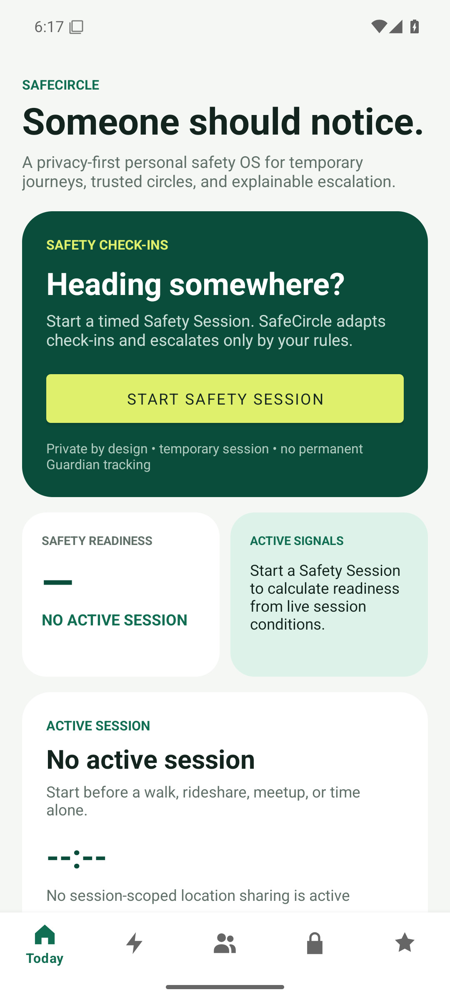
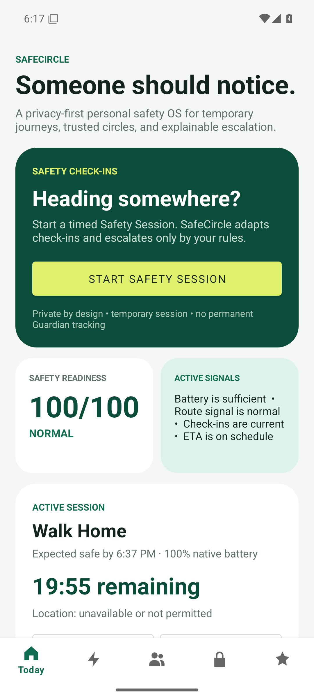
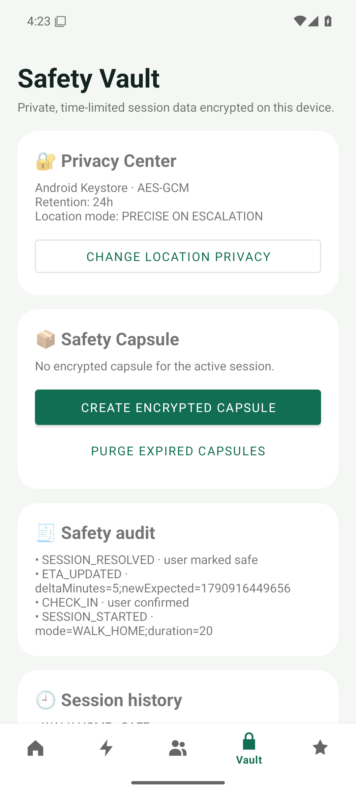
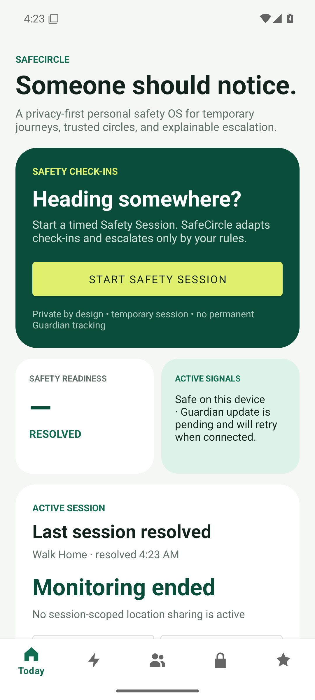
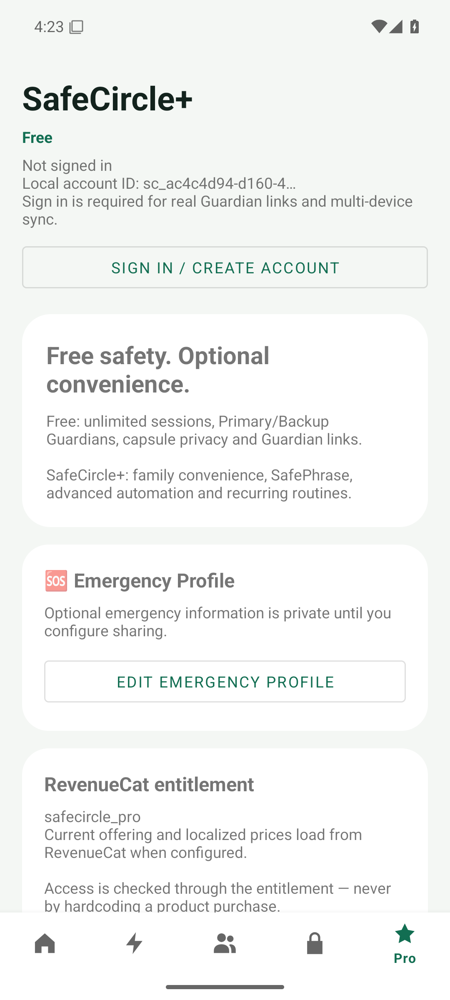

<p align="center">
  
</p>
<h1 align="center">SafeCircle</h1>
<p align="center"><strong>Temporary safety check-ins. A trusted circle. Privacy on your terms.</strong></p>
<p align="center">
  <a href="#screenshots">Screenshots</a> ·
  <a href="https://github.com/harshapriyag123/safecircle/actions/runs/36904874195/artifacts/11182798938">Download debug APK</a> ·
  <a href="https://safecircle-site.vercel.app/site">Public preview</a> ·
  <a href="docs/SHIPATON.md">Shipaton checklist</a> ·
  <a href="https://github.com/harshapriyag123/safecircle/pull/2">Implementation PR</a>
</p>
<p align="center">
  <a href="https://github.com/harshapriyag123/safecircle/actions/workflows/android.yml"></a>
  
  
  
</p>

SafeCircle is a native Android safety check-in app with a FastAPI backend, temporary signed Guardian links, a web companion and a reference SwiftUI iOS client. Choose an expected-safe time, check in along the way and give consenting Primary and Backup Guardians a limited view of a session.

**Essential safety stays free.** Optional convenience features use RevenueCat's `safecircle_pro` entitlement. This development build has no configured billing key; successful purchases and provider delivery remain unverified.

## Highlights

- **Free safety workflow:** sessions, check-ins, ETA extensions, marking safe, Guardian links and basic privacy controls.
- **Clear escalation:** +5 minutes routes to Primary, +10 to Backup, +15 to both. Resolving or changing the ETA cancels obsolete pending jobs.
- **Durable delivery:** persistent jobs, deduplication, bounded retries and separate queued, provider-accepted and confirmed-delivered states.
- **Consent and privacy:** signed expiring links, Status Only mode, authorized location disclosure, encrypted capsules and expiry cleanup.
- **Optional RevenueCat billing:** native paywall, entitlement, restore and Customer Center; webhook processing and authoritative subscriber reconciliation.
- **Reproducible development:** genuine Gradle wrapper, automated tests/lint/APK builds, Android emulator workflow and iOS simulator CI.

## Screenshots

Actual Android 15 emulator captures from [the verified build](docs/VERIFICATION.md), using local test data. These show the native app, not a successful store purchase or external alert.

<table>
  <tr>
    <td align="center"></td>
    <td align="center"></td>
    <td align="center"></td>
  </tr>
  <tr><td align="center"><strong>Start a session</strong></td><td align="center"><strong>Check in and extend ETA</strong></td><td align="center"><strong>Control privacy</strong></td></tr>
</table>

<table>
  <tr>
    <td align="center"></td>
    <td align="center"></td>
  </tr>
  <tr><td align="center"><strong>Mark safe</strong></td><td align="center"><strong>Free safety, optional extras</strong></td></tr>
</table>

The [website demo screenshot](web/site/assets/guardian-demo.png) depicts a fictional Guardian session and is labeled simulated. The [1024px app icon](web/site/assets/app-icon-1024.png) is exported from the existing native vector.

## Verified results and limits

| Area | Verified evidence | Still needed |
| --- | --- | --- |
| Backend | 50 SQLite tests and 51 PostgreSQL tests passed | Production persistence and real provider delivery |
| Android | 11 unit tests, lint (0 errors; 414 warnings), debug APK and Android 15 offline workflow passed | Store test track, billing configuration and physical-device background tests |
| iOS reference client | Simulator build with RevenueCat/RevenueCatUI passed | Signing, device purchases and full Android feature parity |
| Web/Guardian | Desktop/mobile browser checks, signed acknowledgement/resolution and privacy checks passed | Live production setup and complete native demo video |
| RevenueCat | SDK and server lifecycle/reconciliation code checked | Actual offerings/products, purchases, restore and Customer Center verification |

See [build evidence and checksums](docs/VERIFICATION.md), [gap audit](docs/GAP_AUDIT.md) and the single [external prerequisites list](docs/EXTERNAL_REQUIREMENTS.md). No downloads, revenue, customer feedback, store publication or successful live delivery/purchase is claimed.

## Website status

The public product site is implemented under `web/site/`, with a landing page, screenshots, a labeled simulated demo, privacy policy, support links and testing instructions. The web companion and signed Guardian experience use the backend.

**Vercel website and backend code are deployed:** https://safecircle-site.vercel.app/site

The repository branch `shipaton/completion` deploys automatically to the existing free Hobby project. Landing page, companion and signed Guardian client code are hosted together. A dedicated free Neon database and private production secrets are configured; new monitored sessions additionally require a current alert-worker heartbeat. Native defaults now use this origin, but live account, alert and purchase flows remain unverified. See [Vercel setup](docs/VERCEL_DEPLOYMENT.md).

Run locally at `http://localhost:8080/site/`; open the companion at `http://localhost:8080/app/v4.html`, demo at `http://localhost:8080/site/demo.html` and privacy policy at `http://localhost:8080/site/privacy.html`. Real Guardian links require a signed token. The native video section is marked pending.

## Documentation

- [Android/backend verification and APK](docs/VERIFICATION.md)
- [Deployment, providers, secrets and storage](docs/DEPLOYMENT.md)
- [RevenueCat configuration and device test matrix](docs/REVENUECAT.md)
- [Shipaton requirements, demo script and award assessment](docs/SHIPATON.md)
- [Remaining external prerequisites](docs/EXTERNAL_REQUIREMENTS.md)
- [iOS setup](ios/README.md)

## Android setup

Use Java 17, the checked-in Gradle 8.14.3 wrapper, Android Gradle Plugin 8.13.2, Kotlin 2.1.20, Android SDK platform 36 and build tools 35.0.0. The wrapper JAR was generated by official Gradle tooling; its distribution is SHA-256 pinned. Android supports API 26+ and targets API 36.

Install Android Studio or command-line SDK tools. Create an ignored `local.properties`:

```properties
sdk.dir=/absolute/path/to/android-sdk
REVENUECAT_API_KEY=
SAFECIRCLE_API_BASE_URL=https://your-verified-host.example
```

Replace the example API origin with your verified HTTPS backend; the previous Railway domain is currently unavailable.

Set `REVENUECAT_API_KEY` only to your Android public SDK key (`goog_...`; a test-store key is for development only). An empty key disables billing while safety scheduling remains active. Never embed secret API keys or use `proj5f7132ef` as a credential. Do not set a shared demo access token in a distributed build.

```sh
./gradlew --no-daemon testDebugUnitTest lintDebug assembleDebug
adb install -r app/build/outputs/apk/debug/app-debug.apk
```

Android CI repeats these tasks and uploads the APK and reports. Download the latest successful PR run's `safecircle-debug-*` ZIP from [Actions](https://github.com/harshapriyag123/safecircle/actions/workflows/android.yml); unzip `app-debug.apk`. Artifacts expire after 30 days and downloads require GitHub sign-in. Debug installation does not qualify as a public store release.

Sign in, create a session and configure distinct E.164 Primary/Backup phone contacts only with their consent. Guardian link creation and SMS provider delivery are separate operations. External notifications require production provider configuration. Use test participants until delivery and background-device behavior are verified.

## Backend and website

```sh
python -m venv .venv
. .venv/bin/activate
pip install -r backend/requirements.txt
PYTHONPATH=backend python -m pytest backend/tests -q
PYTHONPATH=backend python -m uvicorn app.entrypoint:app --port 8080
```

Configure variables from `backend/.env.example` in the process environment (the file is a template, not automatically loaded). `/` redirects to `/site/`; `/app/v4.html` is the companion; `/guardian/?token=...` is a real Guardian view requiring a signed link. `/site/demo.html` is explicitly simulated and sends no notifications. `/site/privacy.html` describes current data handling. The video section truthfully marks the native recording as pending.

The root Dockerfile supports self-hosting. Production uses the existing Vercel Hobby project with dedicated Neon PostgreSQL. The tested one-minute scheduler adapter is in [scheduler/cloudflare](scheduler/cloudflare/README.md); it requires account access and live verification before monitoring is available.

## Safety behavior

At the expected-safe time, the user should check in. At +5 minutes, jobs route to Primary; +10 to Backup; +15 to both. Jobs are persistent and deduplicated by session, deadline, stage, role and channel. Provider acceptance is not delivery confirmation. Signed callbacks or authenticated receipts confirm delivery. Missing providers keep jobs queued without consuming attempts; definite rejections use bounded retries. Uncertain SMS outcomes wait for a receipt rather than risk a duplicate send. Push adapters must honor the idempotency key.

Check-ins ensure at least five minutes until the deadline. ETA extension creates a new deadline cycle and cancels old pending jobs. Resolution is terminal and cancels pending jobs. Already accepted messages cannot be recalled. Capsule expiry is capped at 24 hours; the worker purges expired payloads and redacts Guardian data independently of expiry cleanup.

## iOS and submission

See [iOS setup](ios/README.md). CI generates the Xcode project and builds the simulator. Apple public SDK key, store products, signing and device purchase testing remain required if iOS is submitted. The iOS client does not yet provide full Android feature parity.

No downloads, revenue, customer feedback, store listing or successful live delivery/purchase is claimed. Shipaton 2026 standard entries require a qualifying store release; eligible students have the Next Gen exception. The website and debug APK are testing aids.

SafeCircle does not dispatch emergency services. Contact local emergency services directly when immediate help is needed.

See [external prerequisites and live checks](docs/EXTERNAL_REQUIREMENTS.md) before treating this build as deployed or submission-ready.
