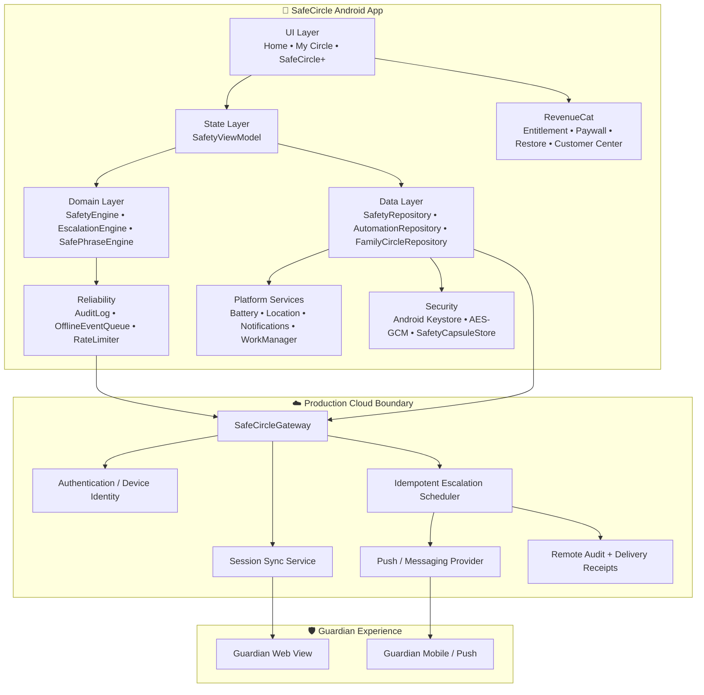
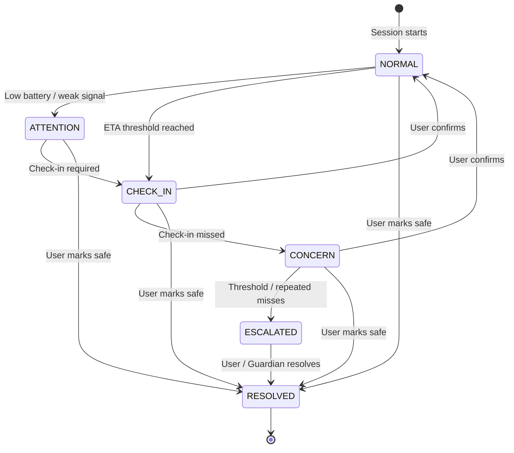
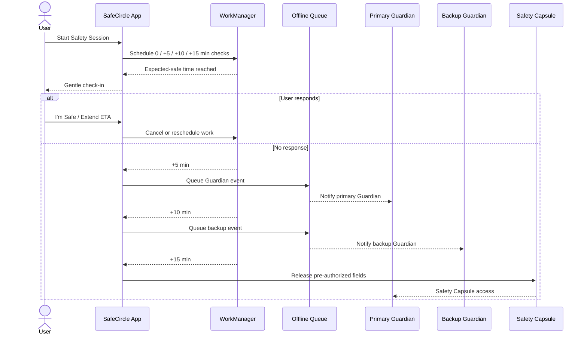
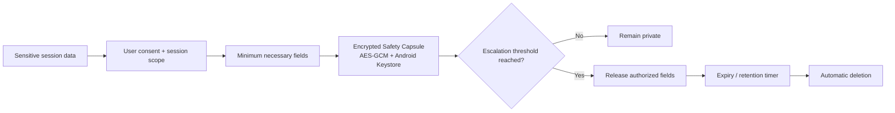
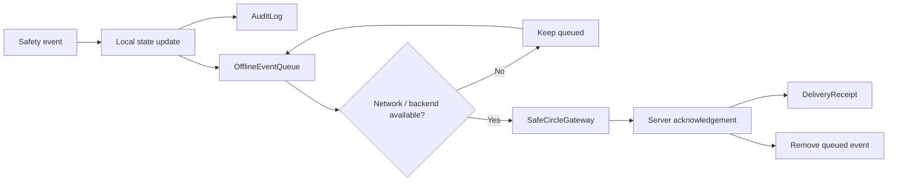
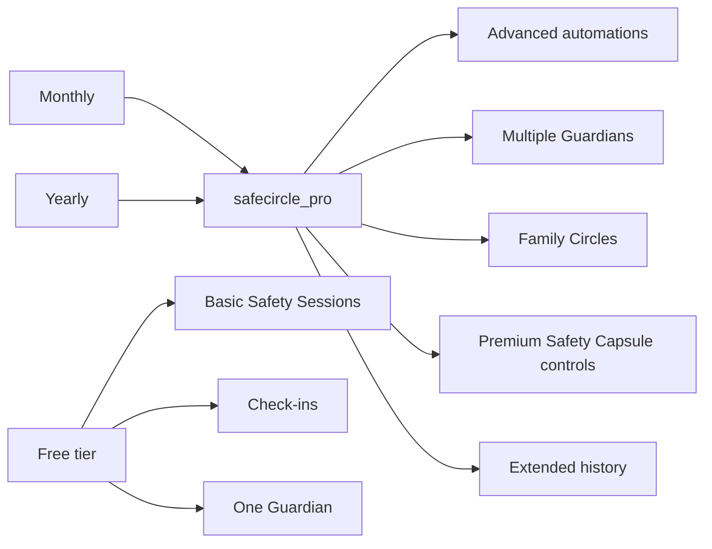

# SafeCircle Architecture

SafeCircle is a layered personal-safety platform built around temporary Safety Sessions, explainable state transitions, Guardian escalation, privacy-preserving data release, and subscription-based premium automation.

---

## 1. System architecture



---

## 2. Safety Session lifecycle



The engine does **not** claim to predict danger. It maps observable session conditions into an explainable state.

---

## 3. Escalation sequence



---

## 4. Privacy architecture



Key rules:

- location sharing is session-scoped;
- precise location is opt-in;
- Safety Capsules expire;
- local capsule data is encrypted with Android Keystore-backed AES-GCM;
- core safety features do not depend on subscription state.

---

## 5. Offline-first reliability



The app has local queue, rate limiting, audit events, and a cloud gateway contract. A real backend implementation can replace the demo gateway without changing Safety Engine logic.

---

## 6. RevenueCat entitlement boundary



This prevents monetization from becoming a single-product-ID dependency.

---

## 7. Code map

```text
app/src/main/java/com/harshapriya/safecircle/
├── auth/
│   └── AccountRepository.kt
├── automation/
│   ├── AutomationRule.kt
│   └── AutomationRepository.kt
├── background/
│   ├── SafetyScheduler.kt
│   ├── SafetyCheckWorker.kt
│   ├── RecurringCommuteScheduler.kt
│   └── RecurringCommuteWorker.kt
├── billing/
│   └── SubscriptionManager.kt
├── data/
│   ├── Constants.kt
│   └── SafetyRepository.kt
├── domain/
│   ├── SafetyEngine.kt
│   ├── EscalationEngine.kt
│   └── SafePhraseEngine.kt
├── family/
│   └── FamilyCircleRepository.kt
├── guardian/
│   └── GuardianInviteService.kt
├── platform/
│   ├── BatteryMonitor.kt
│   ├── LocationProvider.kt
│   └── NotificationService.kt
├── reliability/
│   ├── AuditLog.kt
│   ├── DeliveryReceipt.kt
│   ├── OfflineEventQueue.kt
│   └── RateLimiter.kt
├── security/
│   ├── CryptoBox.kt
│   └── SafetyCapsuleStore.kt
├── sync/
│   ├── SafeCircleGateway.kt
│   └── LocalDemoGateway.kt
└── ui/
    ├── home/
    ├── circle/
    ├── profile/
    └── shared/
```

---

## 8. Phase coverage

### Phase 1 — Core
Implemented: Safety Sessions, readiness score, state engine, Guardian model, RevenueCat entitlement, paywall, restore flow, Customer Center.

### Phase 2 — Connected Safety
Implemented in Android/local form: Guardian invitation sharing, WorkManager escalation jobs, device battery, consented location adapter, editable ETA API, offline event queue, recurring commute scheduler, Guardian web prototype.

Remote push delivery and live multi-device synchronization are represented by `SafeCircleGateway` and require a real backend/provider configuration.

### Phase 3 — Privacy & Reliability
Implemented: Android Keystore encryption, Safety Capsule store, expiration purge support, audit log, rate limiter, delivery receipt model, idempotent-stage keys, offline queue, threat model.

### Phase 4 — Family & Multi-surface
Implemented: Family Circle repository, Guardian web prototype, recurring commute scheduler, automation rule repository, stable local cross-device account identifier contract.

A production multi-device account system still requires authenticated cloud identity and server-side authorization.

---

## 9. Production boundary

The repository now contains working mobile-side implementations and explicit integration contracts for all roadmap phases. It does **not** pretend that local demo adapters are a production emergency network.

Before real-world deployment, SafeCircle still needs:

- authenticated cloud backend;
- verified Guardian acceptance;
- real push/SMS provider credentials;
- server-side idempotency and delivery acknowledgement;
- secure multi-device session sync;
- penetration/security review;
- privacy/legal review;
- accessibility and reliability testing;
- emergency-services policy review.
